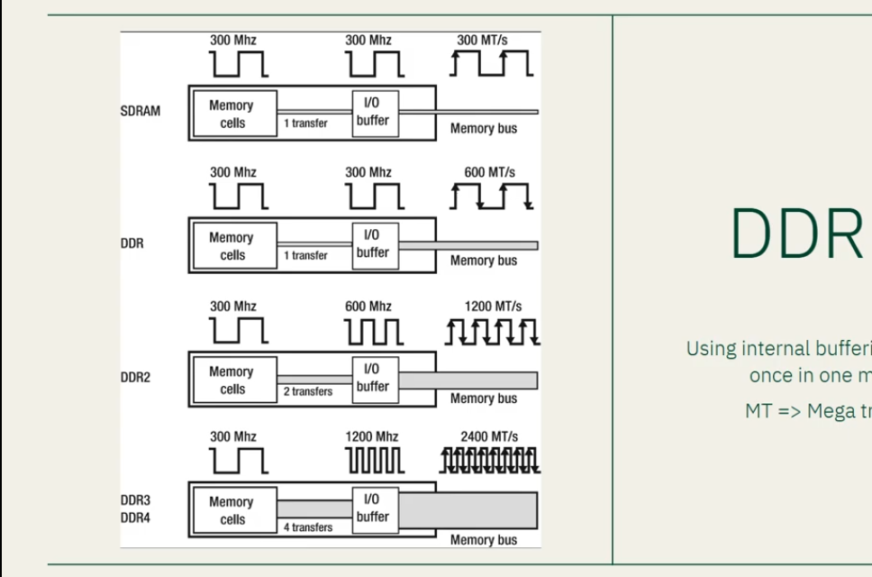

# clock Cycle
* The unit of measurement for clock cycle is *Hz*<Hertz> that mean in 1 second can do 60Hz , 60 times in HZ can be refresh.

# SDR

sending 1 data in ram on clock cycle.
# DDR <Double Data Rate>
sending 2 data in ram on clock cycle

# Transistors
* that is a kilied that work automaticly when current go there is active automaticly
* can read data from hard ware

# Latency
## tCL
* the time that data to ready for read
## tRCD

## tRP

## tRAS

# CLR 
* automaticlayy garbageCollector.
## JIT (Just-in-time)
* transform our code to machine code.
## TypeSystem
* division byte to the type  ==> long n byte

## Exception handling 
* magaing the crash core
## GC (Garbage Collector).
