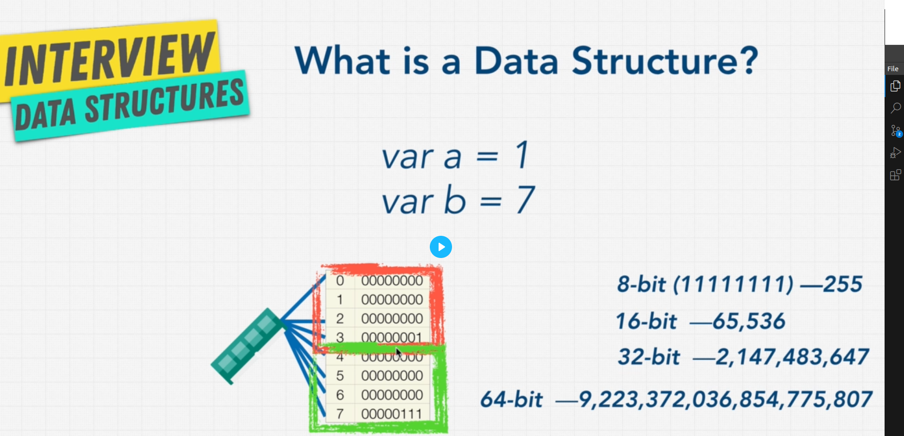
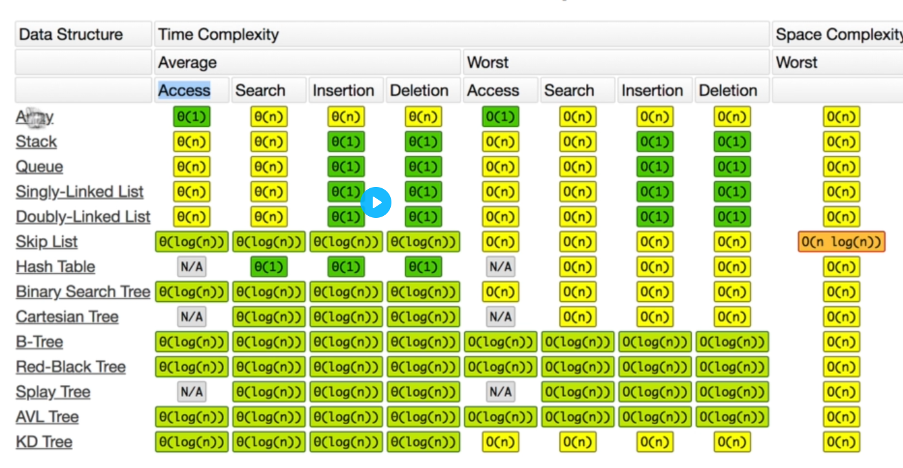

# What is Big O :
Big o notation is mathmatical notation that describe the limiting behavior a function when the argument tends towards a particular value or infinity.
Big O روشی برای سنجش کارایی انجام یک الگوریتم است. هر چه Big O بیشتر باشد، کارایی الگوریتم مورد نظر، کمتر است.
that is a idea for write Scable code
1) o(1) ==>Constant the performance console.log(1). a[0]
2) Log O(n) ==> Logarithmic  half the date.
3) o(n) ==> Linear for(loop). change with the 
4) o(n^2) ==>Quadratic nest for.
5) o(2^n )==>Exponential the recursive Fibonacci algorithm.

for 100 ==> o(100)

# Heap & Stack:
1) heap usually where we store variables.
2) stack is usually where we keep track of our function calls
# Algorithm
In mathematics and computer science, an algorithm is a finite sequence of mathematically rigorous instructions,Algorithm is a step-by-step for solving a problem.
Algorithms are used as specifications for performing calculations and data processing.
* Sorting
* Dynamic Progrmming
* BFS + DFS (searching)
* Recursion
# DataStructure

A data structure is a specialized way of organizing, managing, and storing data in a computer so that it can be accessed and modified efficiently.
AND if we want to Insertion OR Deletion OR SEARCHING, ,.... a date that store with DataStructure now we use the Algorithm.
1) Efficiency: They help in optimizing operations like searching, insertion, deletion, sorting, etc., depending on the structure used.
2) Data Management: They provide a way to manage large amounts of data efficiently, such as databases, file systems, and more.
3) Algorithm Efficiency: Algorithms often rely on data structures to operate efficiently. For example, graph traversal algorithms require a graph data structure to represent relationships between objects.
* Arrays
* Stacks
* Queues
* Linked Lists
* Trees
* Tries
* Graphs
* Hash Tables

## two broad categories:
### Linear Data Structure :
Date elements are arranged sequentially or lineart that which element is attached to its previous and next adjacent elements Examples are array, stack, queue, etc.
### on-linear Data Structure :
Date elements are not sequentially or lineart like trees and graphs.

<!-- Basic Date Structures -->
# LinkList 
it is a type of the data structure use for storing conection of data and it is liner. the data store in node each of has Or contain of a dad field with refrecnce (link) to the next node in the sequence;
2 types link0list ==> 1. single link-list 2.doubly link-list
1.single ==> each nodes points to the next node and end is null
2.doubly ==> each node has two link
### why is good?
A linked list provides flexibility in how data is stored and accessed compared to arrays. While arrays have fixed size and require contiguous memory allocation, linked lists dynamically grow and shrink, allowing efficient insertion and deletion of elements.
1) Dynamic Size: Unlike arrays,
2) Slower Access Time: Linked lists don’t provide direct access to elements by index like arrays.
### Drawbacks
1) Memory Overhead : Each node in a linked list requires extra memory for the pointer(s)
# Queues 

it is similar to stack but from the firsts,they are a type of datastructure that their element held in a sequence till end. and the elements enqueued end of the  sequence and First in First out(FIFO).
and it is good for priniting jobs and handleing request in web service , Peek (get the top element).
operation in Enqueue (insert),Dequeue (remove) 
# Stack
Stack in Data Structures is a liner type abd follows the LIFO <last-in-first-out> that can insert or delete form top of the data.
Implement Stack contiguous memory which is Array, or non-contiguous memory like linklist.
push(),pop(),peek(),isEmpty();
### why is good ?
Stack is simple but it is powerful and it used in computing because it can managed data  when you need to process elements in reverse order.
just you can (you can only add/remove from one end);
1) Simple to Use.
2) Memory Management: Stacks are used in programming languages to manage function calls, allowing for easy tracking of which functions were called and where to return after a function completes.
3) Reversing Data: They are useful when you need to reverse an order of elements. For example, reversing a word.
4) Undo Mechanism: Many applications (like text editors) use stacks to implement undo features.
5) Build compilers(syntax checking)

# ARRAY 
if our data is step by step <one by one> is it good.
const strings = ['a','b','c','d'] ==> // 4*4 = 16 bytes of storages
* lookup(O(1))
* Push(O(1)) && POP(O(1)) // just add at in end and no loop
* Insert(O(n))
* Delete(O(n))
array is liner datastructer that can hold elements and arrange them and it uses  contiguous<contious> memory space to store elements and 
in array we can directly access any element 

# HASH-TABLE<HASH_MAP>
hash tables are specialized data structure that alows fast access to data based on a key
it works by using a hash function to compute an index(called hash code) in to an array that where the desired value can be store or found.
hash tables are very fast