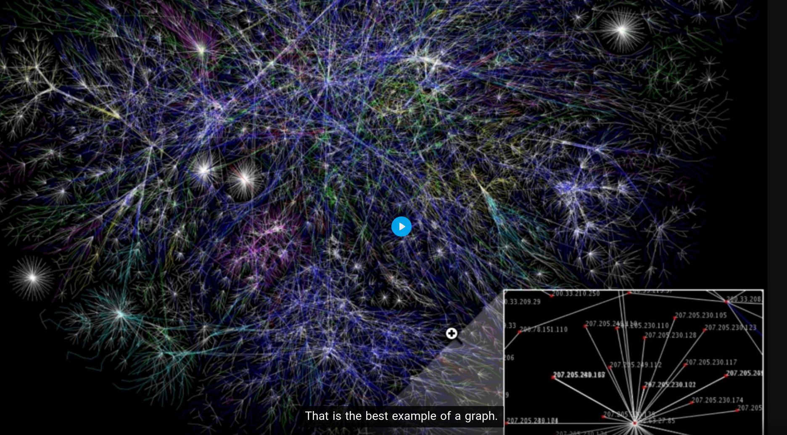

# ⭐ What is Big O ⭐ :
Big o notation is mathmatical notation that describe the limiting behavior a function when the argument tends towards a particular value or infinity.
Big O روشی برای سنجش کارایی انجام یک الگوریتم است. هر چه Big O بیشتر باشد، کارایی الگوریتم مورد نظر، کمتر است.
that is a idea for write Scable code
1) o(1) ==>Constant the performance console.log(1). a[0]
2) Log O(n) ==> Logarithmic  half the date.
3) o(n) ==> Linear for(loop). change with the 
4) o(n^2) ==>Quadratic nest for.
5) o(2^n )==>Exponential the recursive Fibonacci algorithm.


for 100 ==> o(100)


# ⭐ Heap & Stack ⭐:
1) heap usually where we store variables.
2) stack is usually where we keep track of our function calls
* Primitive types (like numbers, booleans, etc.): 
    + These are usually stored directly on the stack if they are local variables.
    + Designed for dynamic memory allocation.
    + Ideal for objects or structures that might change size or persist longer than the function's execution
* Objects (like arrays, custom objects, or instances of classes):
    + The actual object data is stored in the heap because objects can grow dynamically in size.
    + A reference (or pointer) to the object is stored in the stack.
    + Designed for fixed, short-term memory
    + Efficient for storing references, local variables, and function calls.
 
* Garbage Collection (GC) is primarily associated with managing memory in the heap<object>, not the stack --> dlete auto by system.    


# ⭐ DataStructure ⭐

A data structure is a specialized way of organizing, managing, and storing data in a computer so that it can be accessed and modified efficiently.
AND if we want to Insertion OR Deletion OR SEARCHING, ,.... a date that store with DataStructure now we use the Algorithm.
1) Efficiency: They help in optimizing operations like searching, insertion, deletion, sorting, etc., depending on the structure used.
2) Data Management: They provide a way to manage large amounts of data efficiently, such as databases, file systems, and more.
3) Algorithm Efficiency: Algorithms often rely on data structures to operate efficiently. For example, graph traversal algorithms require a graph data structure to represent relationships between objects.
* Arrays
* Stacks
* Queues
* Linked Lists
* Hash Tables
* Trees
    * AVL Tree
    * Red Black Tree
    * Binary heaps
    * Tries
* Graphs


### Linear Data Structure :
Date elements are arranged sequentially or lineart that which element is attached to its previous and next adjacent elements Examples are array, stack, queue, etc.
### on-linear Data Structure :
Date elements are not sequentially or lineart like trees and graphs.


<!-- Basic Date Structures -->

1) # ARRAY 
if our data is step by step <one by one> is it good.
array is liner datastructer that can hold elements and arrange them and it uses  contiguous<contious> memory space to store elements and 
in array we can directly access any element 

const strings = ['a','b','c','d'] ==> // 4*4 = 16 bytes of storages
* lookup(O(1))
* Push(O(1)) && POP(O(1)) // just add at in end and no loop
* Insert(O(n)) Unshift(O(n)) // because add in first array
* Delete(O(n))
- if we have douple array memory has bad performance
- bad performance for insert OR delete
- if we want to add in middle array we have to push are an elenemant to the end
+ it is good for searchin
+ it is good for caching for reading
## static array
that mean the lenght is identify/
just we can define an array 
<!-- C++ -->
int a[20];
int b[5] {1,2,3,4,5}
## Dynamic array
in js and python array is Dynamic and for manage memery is so hard


2) # HASH-TABLE<HASH_MAP>
https://www.cs.usfca.edu/~galles/visualization/OpenHash.html

hash tables are specialized data structure that alows fast access to data based on a key
it works by using a hash function to compute an index(called hash code) in to an array that where the desired value can be store or found.
 - they are not ordered
* object is type of hash table
* python is dectionray
* java maps
* ruby hashes
- hash tables are very fast.

### Hash Function
A hash function is a mathematical algorithm that transforms an input (or "message") into a fixed-length output called a 
hash value or digest. The process involves applying a deterministic algorithm such that the same input always produces the same output.
 Hash functions are commonly used in various fields such as cryptography, data structures, and data integrity verification.
### Hash Value
A hash value (or hash code, digest) is the result of applying a hash function to input data. It is a compact representation of the data, often represented as a string of hexadecimal or binary digits.
#### Popular Hash Functions
MD5: Produces a 128-bit hash value (considered insecure for cryptography).
SHA-1: Produces a 160-bit hash value (deprecated due to vulnerabilities).
SHA-256: A widely-used cryptographically secure hash function.
CRC32: Used for error-checking in data transmission.
bcrypt: Used for securely hashing passwords with added salt.
* lookup(O(1))
* Push(O(1)) && POP(O(1))
* Insert(O(1)) 
* Delete(O(1))
- they are not ordered
### collision
create a buckets in memory and  store two value in a a memory address,but with different buckets
* often it happend for the same value.
* in collision O is  O(n)
### PROBLEM
our computer has limited space
### MD5
this hash for each string we have a hash same input


3) # LinkList 
it is a type of the data structure use for storing conection of data and it is liner. the data store in node each of has Or contain of a dad field with refrecnce (link) to the next node in the sequence;
2 types link0list ==> 1. single link-list 2.doubly link-list
1.single ==> each nodes points to the next node and end is null
2.doubly ==> each node has two link

* Prepend(O(1)) ---> Add in first
* append(O(1)) ---> add end of the node
* lookup(O(n))
* insert(O(n))
* delete(O(n))
- look up in array is o(1) but in link list is O(n)
- loop on linklist is slower thant array and bot are o(n)
+ insert in midle is very bether than array and they are ordere unlike hashmap
### why is good?
A linked list provides flexibility in how data is stored and accessed compared to arrays. While arrays have fixed size and require contiguous memory allocation, linked lists dynamically grow and shrink, allowing efficient insertion and deletion of elements.
1) Dynamic Size: Unlike arrays,
2) Slower Access Time: Linked lists don’t provide direct access to elements by index like arrays.
+ array and linklist ==> if we want to add in array in middle we have to push all array to end but in linklist no becase we have poinert and node

```
 ### MAP,HASH
 const obj1 = {a:true};
 const obj2 = obj2
 obj1.a = "salam"
 obj1,2 ==> salam becasuse they are refrences type

 ## LINK_LIST
 10--> 9 --> 4
 let my_link_list = {
    head: {
        value:10,
        next: {
            value:9,
            next:{
                value:4,
                next:nul
            }
        }
    }
 }
```
### Drawbacks
1) Memory Overhead : Each node in a linked list requires extra memory for the pointer(s)


4) # Stack
* we can implement with array or linklist (array is good for cach and fast ,.....)
Stack in Data Structures is a liner type abd follows the LIFO <last-in-first-out> that can insert or delete form top of the data.
Implement Stack contiguous memory which is Array, or non-contiguous memory like linklist.
 it is look like dishes
* lookup O(n)
* pop O(1) remove last item
* Push O(1)
* peek O(1) show top value
### why is good ?
Stack is simple but it is powerful and it used in computing because it can managed data  when you need to process elements in reverse order.
just you can (you can only add/remove from one end);
1) Simple to Use.
2) Memory Management: Stacks are used in programming languages to manage function calls, allowing for easy tracking of which functions were called and where to return after a function completes.
3) Reversing Data: They are useful when you need to reverse an order of elements. For example, reversing a word.
4) Undo Mechanism: Many applications (like text editors) use stacks to implement undo features.
5) Build compilers(syntax checking)
6) what data it was save in last

5) # Queues 
* we can implement with array or linklist (array is good for cach and fast ,.....)
* it is not good implement with array beacue when you rmeove from first all element should return back O(n) and link link list i good <head,Tail>
it is similar to stack but from the firsts,they are a type of datastructure that their element held in a sequence till end. and the elements enqueued end of the  sequence and First in First out(FIFO).
and it is good for priniting jobs and handleing request in web service , Peek (get the top element).
operation in Enqueue (insert),Dequeue (remove) 
* look O(n)
* enqueue O(1)
* dequeue O(1)
* peek O(1)
### why is good?
1) it is look printer

6) # Tree

* linklist is typeically tree just with one path
* A Tree data structure is a type of non-liner and it is hierarchical data strauctre that data consist of of node.
* it follows the parent-child relationship and the top value called root.
* each nodes in a tree can have child nodes Or each nodes just have single.
* nodes with same parent called siblings.
* Nodes without any children are referred to as leaves.
* in tree, the simplification it provides in accessing, managing and manipulating data with complex relationships makes it a vital data structure in computer scienc.
* it is good for fileSystem
## Binary Tree
 // wront because it has 3 child 
* each node at most two children left and right child. or ziro chilod
### Binary Search Tree (BST)
* each nodes contains tow child and it orders by the less value are in right and the child more are in the left
* The left subtree contains nodes with keys less than the parent node’s key.
* The right subtree contains nodes with keys greater than the parent node’s key.
* No duplicate nodes are allowed

* O(log N) ---> that mean we search just on half data not on all,dividing
* 1) lookup ----> O(log N). beacue each time we half the data
* 2) insert ---> O(log N).
* 3) delete ---> O(log N)
+ Better than O(n)
+ Ordered
+ Flexible Size
+ Searching for elements
* Dynamic sets of elements.
* databases and language parsing
- No O(1) Operation
- If not balanced, the tree can become skewed , leading to O(n) time complexity for some operations.(we can use AVL or Red-Black Or B-Tree)
### AVL Tree
* it is the self-balancing Binary search tree.
* It ensures that the tree remains balanced to avoid the worst-case performance of a standard BST.
* For any node, the height difference between its left and right subtrees (called the balance factor) must be at most 1.
* Lookup, insert, and delete all have O(log n) time complexity.
+ Situations requiring fast lookups, such as in databases and memory management systems.
- The balancing operations may introduce overhead during insertions and deletions compared to an unbalanced BST.
### RED-Black Tree
* A Red-Black Tree is another type of self-balancing Binary Search Tree that uses a color (red or black) for each node to ensure balance.
* The root is always black.
* A red node cannot have a red child (no two consecutive red nodes).
* Every path from a node to its descendant null pointers has the same number of black nodes.
* Balancing is maintained using rotations and color changes.
* Lookup, insert, and delete operations are all O(log n).
### Binary Heap
* the parent all the time is bigger than the child
* every node in the top level is the highet value so if we insert the number is big we have to switch it.
* our root is 91 so we add 100 it goo down and it come up until it less than the a number.
* Max-Heap: The key of each node is greater than or equal to the keys of its children.
* Min-Heap: The key of each node is less than or equal to the keys of its children.
* Insertion and deletion take O(log n), while the getMin() or getMax() operation takes O(1).
* it is good for comparative operations
* look up is O(N).
* insert O(Log(N)).
* delete O(Log(N)).
+ Priority queues
+ Heap Sort algorithm.
+ insert is very fast
- Unlike BSTs, heaps do not support efficient searching of arbitrary elements (O(n) in worst case).
### Priority queue
* imagine you are in the queue and you are in the first but some people that are familler with givermant come and they are in front of you so to this class called
# Tries

* these has 3 three cgild
* it is good for dictionary
* store and retrieve strings
* Each node in a Trie represents a character.
```
 (root)
       /  |  \
      c   ... 
     / \
    a   ...
   / \
  t   r
  |    \
(end)   t
         |
       (end)
Words stored in the Trie:
cat
car
cart       
```
### B-Trees
* commonly used in systems where read and write operations are performed on disk.
* it is good for operation I/O because can save all of the structure.
* the internal nodes can store more than one key.
*  if a node contains the values [10,20,30] it has four children: the first contains values less than 10, the second contains values between 10 and 20, the third contains values between 20 and 30, and the fourth contains values greater than 30.
A B-Tree is a self-balancing search tree designed to maintain sorted data and allow for efficient insertion, deletion, and search operations. It's widely used in databases and file systems because it minimizes disk I/O operations by keeping its structure balanced.
# Graph



* hash tables , arrays , trees , linklist are all part of graphs simply uses
* tree type of the graph
* each node called (Vertex) and node connect with (Edge).
* it is good for relationship data.
* ususaly use for network or google map for relation the road path
## type of Graph
1) Directed:


* Directed . In a directed graph, all the edges are unidirectional 
* they only go one way.
* in twitter i can follow a person but an other can or can not follow
2) Undirected:

* i can follow and unfollow

* Weighted <Cyclic‍‍‍‍> : for each  edge is assigned a weight or cost like form tehran till mahshad the distance is 800K
* Unweighted <ACyclic> :graphs don’t have these extra edge information


# ⭐ Algorithm ⭐
In mathematics and computer science, an algorithm is a finite sequence of mathematically rigorous instructions,Algorithm is a step-by-step for solving a problem.
Algorithms are used as specifications for performing calculations and data processing.
* Sorting
* Dynamic Progrmming
* BFS + DFS (searching)
* Recursion

1) ## Recursion <Recursive> 
* it is useful when it is tree.
* Recursion is technique used in computer science to solve big problems by breaking them into smaller.
* The process in which a function calls itself directly or indirectly is called recursion and the corresponding function is called a recursive function. 
```
    function factoria(n) { O(n)
        if( n == 2 || n == 1) {
            return n
        }
        retutn n * factoria(n-1)
    }

   #// 0,1,1,2,3,5,8,13,21,34,55,89,144 ...
    function fibonacci(n) {
        if(n<2) {
            return n
        }

        return fibonacci(n-1) + fibonacci(n-2);
    }
    fibonacci(7)
```
## why use it and no iteratively (loop) :
* more code readable.
* loop large Stack
* Recursionis very useful for tree
### call stack over flow
* you are a lots of function should be have and system will be crazy to handle them and it full and dirty system.
```
function test() {
    test()
}
// error max call stack over flow
```